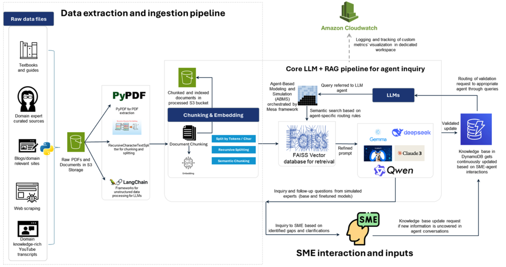
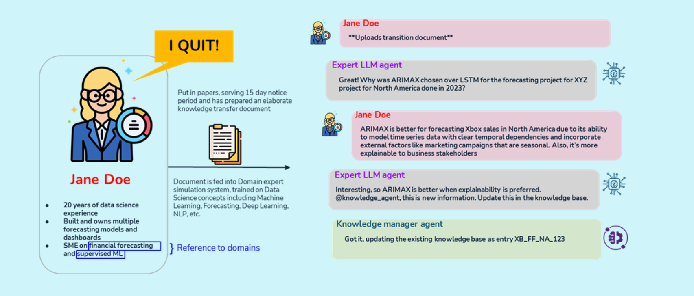
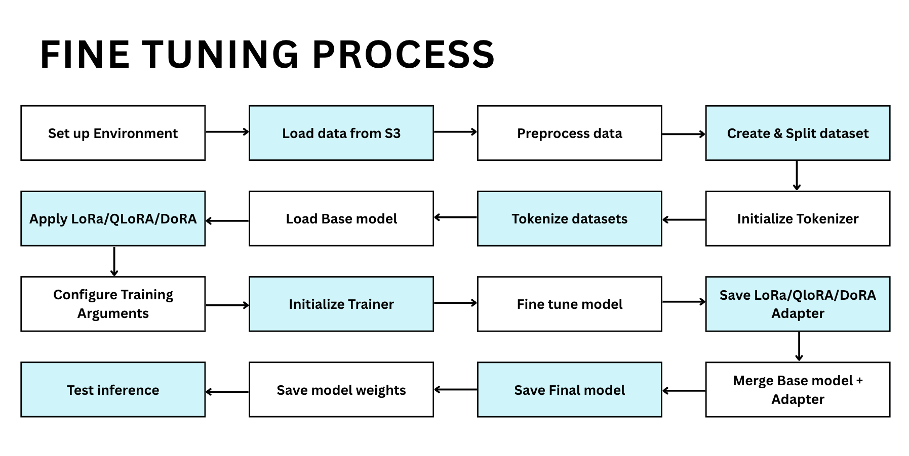

# Simulation of Domain Expert in LLM

A capstone project for the Master of Science in Data Analytics at San Jose State University, aiming to simulate domain expert knowledge using Large Language Models (LLMs), Retrieval-Augmented Generation (RAG), and Agent-Based Modeling (ABM).

## 🧠 Project Overview

In industries where knowledge retention is critical, especially in roles like data science, transferring tacit knowledge from experienced employees is challenging. This project proposes an intelligent system that simulates domain experts using fine-tuned LLMs and RAG pipelines, facilitated through agent-based modeling to support knowledge capture and continuous learning.

---

### 🧠 System Architecture for Agentic Knowledge Capture



---


## 🚀 Key Features

* **LLM Fine-Tuning**: Models fine-tuned using LoRA, QLoRA, DoRA on domain-specific QA pairs.
* **Retrieval-Augmented Generation (RAG)**: Enhances LLM responses using context-relevant retrieval from a vector database (FAISS).
* **Agent-Based Modeling (ABM)**: Uses agents to simulate domain expert interactions, built using the Mesa framework.
* **Dynamic Knowledge Base**: Updates contextual information to DynamoDB through interactions.
* **Evaluation Metrics**: Uses both qualitative (human scoring, relevance) and quantitative (retrieval time, response time, specificity) metrics.

---

## 📊 Use Cases

* Onboarding new data scientists
* Organizational knowledge base retention
* Real-time expert simulation for training and upskilling
* Educational platforms for domain learning

---

### 👩‍💼 LLM Expert Interaction Simulation



---

## 🔧 Tech Stack

| Area                | Tools/Frameworks                                                   |
| ------------------- | ------------------------------------------------------------------ |
| LLMs                | Gemma 2, LLAMA 3.2, Qwen 2.5, DeepSeek Chat, Claude 3 Haiku/Sonnet |
| RAG                 | FAISS, DynamoDB, Python Pipelines                                  |
| ABM                 | Mesa                                                               |
| Data Storage        | AWS S3                                                             |
| Vector Embedding    | Sentence Transformers                                              |
| App & Visualization | Streamlit                                                          |
| Version Control     | Git, GitHub                                                        |
| Project Management  | Gantt, PERT Charts, CRISP-DM Methodology                           |

---

## 📁 Repository Structure

```
📦 Simulation-of-Domain-Expert-LLM
├── data/                      # Raw and processed data
├── docs/                      # Final report, proposal, presentations
├── src/
│   ├── data_pipeline/         # ETL scripts and data preparation
│   ├── model/                 # Fine-tuning and RAG logic
│   ├── abm_simulation/        # Agent definitions and Mesa simulations
│   └── app/                   # Streamlit interface
├── requirements.txt
├── README.md
└── LICENSE
```

---

## 🧪 Evaluation Methodology

Conventional LLM metrics such as **BLEU**, **ROUGE**, or **exact-match accuracy** assume a
*reference answer* as a ground truth and will be compared against the model's output, if we're genearting responses from LLMs. 
In our project, however, the LLMs are **question generators** rather than answer generators:
they ask probing questions to elicit tacit knowledge from a domain expert.  
Because no “gold-standard” reference questions exist, n-gram overlap measures would be
meaningless and potentially misleading.

To fairly assess the system we therefore introduce two complementary families of metrics:

| Category | Purpose | Rationale |
|----------|---------|-----------|
| **Quantitative (Performance)** | Measure the *efficiency* and *breadth* of the LLM’s questioning process | Focuses on *how well* and *how fast* the model operates, independent of subjective judgment |
| **Qualitative (Quality)** | Measure the *usefulness* and *relevance* of each generated question | Relies on expert or high-capability-LLM review, because only humans (or high-level proxies) can judge whether a question is insightful |

### Quantitative Metrics
* **Average retrieval time** – mean latency to fetch context from FAISS/DynamoDB per turn  
* **Average response time** – mean LLM generation latency per question  
* **Information density** – tokens conveying new information ÷ total tokens (higher = more concise)  
* **Context relevance & utilization** – proportion of retrieved chunks actually referenced in the question  
* **Question diversity & specificity** – Jaccard or cosine distance across questions to ensure coverage without redundancy

### Qualitative Metrics
* **Human evaluator score (+1 / 0 / -1)** – domain experts label each question as *useful*, *neutral*, or *off-target*; scores are averaged per model  
* **Claude 3 Sonnet assisted score (0–10)** – an independent, instruction-prompted LLM grades question relevance and gap-finding ability; automated but correlated with human judgment  

> **Interpretation**  
> *Quality* metrics tell us **how insightful** the questions are.  
> *Quantity* (performance) metrics tell us **how efficiently** the system produces those questions.  
> Both dimensions are required: a fast model that asks poor questions is as unusable as a slow model that asks brilliant ones.

---

## 🧪 Models Evaluated

* **Gemma 2 (9B, Base)** – High accuracy for QA and text generation  
* **Gemma 2 (2B, Fine-tuned)** – Lightweight version fine-tuned for domain-specific tasks  
* **Qwen 2.5 (7B, Base)** – Fast and context-aware with strong generation capabilities  
* **Qwen 2.5 (0.5B, Fine-tuned)** – Compact, efficient fine-tuned variant  
* **Claude 3 Sonnet (70B)** – Balanced model ideal for reasoning and document understanding  
* **Claude 3 Haiku (20B)** – Lightweight, highly responsive for large-text inference  
* **LLaMA 3.2 (1B)** – Lightweight, optimized for quick response and low-resource environments  
* **DeepSeek Chat (1.3B, Base)** – General-purpose model with 128K context window  
* **DeepSeek R1 (1.3B, Fine-tuned)** – Fine-tuned for agentic KT simulation tasks
* Note: All fine-tuned models were trained on synthetic question–answer pairs generated from project-specific knowledge transfer documents and role-based project scenarios.

---


## 🧪 Synthetic Data Generation

To evaluate domain-specific LLM capabilities without relying on sensitive or real-world data, we generated synthetic QA pairs using a multi-step LLM-driven process.

1. **Input Roles and Responsibilities**
   - Job descriptions were scraped from LinkedIn for relevant data roles.
   
2. **Generate KT Documents**
   - LLMs created knowledge transfer (KT) documents simulating realistic project contexts and artifacts.

3. **Feed KT Documents**
   - These documents served as input for QA generation prompts.

4. **Generate QA Pairs**
   - The system produced question-answer pairs to simulate knowledge queries for downstream evaluation.

### 🎯 Why Synthetic Data?

- Ensures **privacy and compliance** (no PII or proprietary data)
- Enables **controlled benchmarking** of fine-tuned LLMs
- Encourages **scalability** across domains with minimal manual effort

---


### 🔧 Fine-Tuning Workflow



---

## 📌 Future Work

* Integration with enterprise chat platforms
* Enhancing agent realism through multi-turn dialogues
* Advanced analytics reporting dashboards
* Support for multimodal document ingestion

---

## 👥 Authors

* Aafrin Shehnaz Mohamed Sulaiman
* Aiswarya Raghavadesikan
* Sai Sahithi Bethapudi
* Shreya Chilumukuru
* Veena Ramesh Beknal

Advised by **Dr. Simon Shim** and **Dr. Lee C. Chang**

---

## 📄 License

© 2025. All Rights Reserved.

