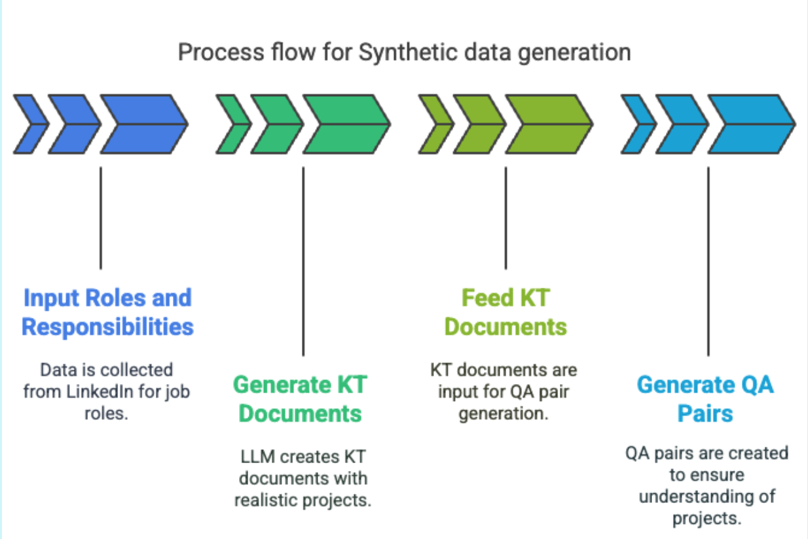

# 🧪 Synthetic Data Generation Process

## 📌 Objective

To simulate realistic knowledge evaluation in specialized domains (e.g., data science, forecasting) without exposing sensitive or private data, we use synthetic QA generation based on LLM pipelines.

---

## 🔄 Step-by-Step Workflow

1. **Input Roles and Responsibilities**
   - Collected job descriptions from LinkedIn (titles like "Data Analyst", "ML Engineer").

2. **Generate KT Documents**
   - Used base LLMs to convert job roles into detailed knowledge transfer documents (KT docs), simulating real project ownership.

3. **Feed KT Documents**
   - These KT docs serve as context for the next LLM step — to generate relevant questions.

4. **Generate QA Pairs**
   - Fine-tuned LLMs generate QA pairs based on KT inputs to mimic realistic SME questioning.

---

## 💡 Why Synthetic Data?

| Benefit              | Description                                                                 |
|----------------------|-----------------------------------------------------------------------------|
| Privacy-preserving   | No real or proprietary company data used                                   |
| Easily scalable      | Can be reproduced across roles/domains                                     |
| Domain-specific      | Maintains semantic richness specific to data roles                         |
| Reproducibility      | Ensures benchmark comparability across runs                                |

---

---

## 📦 Sample Synthetic Data

You can explore a sample set of job roles, generated KT documents, and QA pairs used for fine-tuning and evaluation.

📁 [Download synthetic data sample](docs/assets/sample_synthetic_data.zip)

Contents include:
- Example KT documents
- QA pairs for finetuning
- Input prompts

